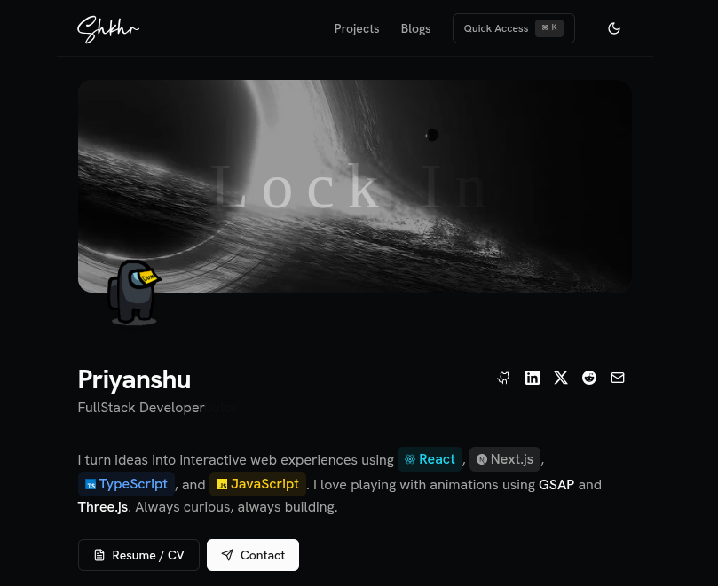

# Preview



A minimal, blazing-fast portfolio website built with modern web technologies.

## Features

- Beautiful UI with shadcn/ui components
-  Lightning-fast performance with Next.js 16
-  Smooth animations powered by Framer Motion
-  Live Spotify integration
-  Fully responsive design
-  Dark/Light theme with advanced transitions
-  Keyboard shortcuts for quick navigation
-  GitHub contributions calendar

## Tech Stack

- **Framework:** Next.js 16 (App Router)
- **Language:** TypeScript
- **Styling:** TailwindCSS + shadcn/ui
- **Animations:** Framer Motion + Magic UI
- **Theming:** next-themes
- **Icons:** Lucide React, React Icons

## Getting Started

### Prerequisites

- Node.js 18+
- npm

### Installation

```bash
# Install dependencies
npm install

# Start development server
npm run dev

# Build for production
npm run build
```

Visit `http://localhost:3000` to see your portfolio.

## Customization

All content is managed from a single file:

```
src/data/resume.tsx
```

Edit this file to update:
- Personal information
- Work experience
- Projects
- Skills
- Social links
- Contact details

No need to modify components—everything is data-driven!

## Environment Variables

Create a `.env.local` file for optional integrations:

```bash
# Spotify Integration
SPOTIFY_CLIENT_ID=your_client_id
SPOTIFY_CLIENT_SECRET=your_client_secret
SPOTIFY_REFRESH_TOKEN=your_refresh_token

# GitHub Contributions
GITHUB_CONTRIB_TOKEN=your_github_token
```

See `.env.example` for more details.

## Keyboard Shortcuts

- `⌘ + K` - Open command menu
- `H` - Go to home
- `P` - Go to projects
- `C` - Go to contact
- `T` - Toggle theme
- `G` - Open GitHub profile

## Project Structure

```
src/
├── app/              # Next.js app routes
├── components/       # React components
├── data/            # Portfolio content
└── lib/             # Utilities
```

## License

This project is open source and available under the [MIT License](LICENSE).
---

If you found this useful, consider giving it a ⭐

Made with ❤️ Priyanshu

